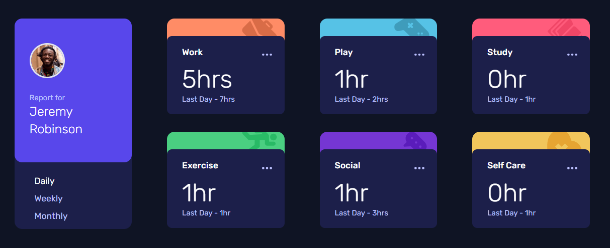
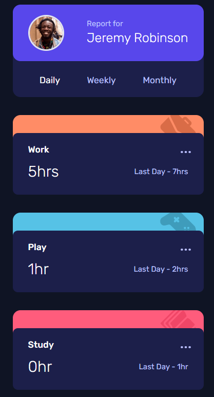

# Frontend Mentor - Time tracking dashboard solution

This is a solution to the [Time tracking dashboard challenge on Frontend Mentor](https://www.frontendmentor.io/challenges/time-tracking-dashboard-UIQ7167Jw). Frontend Mentor challenges help you improve your coding skills by building realistic projects.

## Table of contents

-   [Overview](#overview)
    -   [The challenge](#the-challenge)
    -   [Screenshot](#screenshot)
    -   [Links](#links)
-   [My process](#my-process)
    -   [Built with](#built-with)
    -   [What I learned](#what-i-learned)
    -   [Continued development](#continued-development)
-   [Author](#author)

## Overview

### The challenge

Users should be able to:

-   View the optimal layout for the site depending on their device's screen size
-   See hover states for all interactive elements on the page
-   Switch between viewing Daily, Weekly, and Monthly stats

### Screenshot

### Links

-   Solution URL: [Add solution URL here](https://your-solution-url.com)
-   Live Site URL: [Add live site URL here](https://your-live-site-url.com)

## My process

### Built with

-   Semantic HTML5 markup
-   TypeScript
-   Flexbox
-   CSS Grid
-   Mobile-first workflow
-   [React](https://reactjs.org/) - JS library
-   [Vite](https://vitejs.dev/) - Frontend Tooling
-   [TailwindCSS](https://tailwindcss.com/) - For styles

### What I learned

I had some trouble trying to utilize absolute positioning inside a grid container and making it responsive. Also, ran into some difficulties with TypeScript. In the end I was able to accomplish this, but I'm not sure I'm happy with the code I wrote. It's definitely not perfect. For now, it was the best I could do.

### Continued development

I would like to better my grid and TypeScript skills.

## Author

-   Website - [João P. Kiyoshi](https://joaopkiyoshi.netlify.app/)
-   Frontend Mentor - [@jpkiyoshi](https://www.frontendmentor.io/profile/jpkiyoshi)
-   Twitter - [@jpkiyoshi](https://twitter.com/jpkiyoshi)
